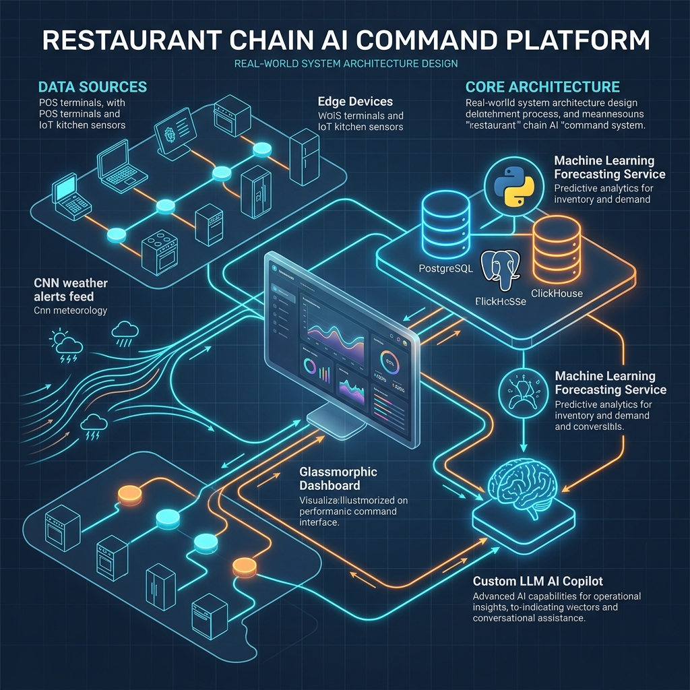
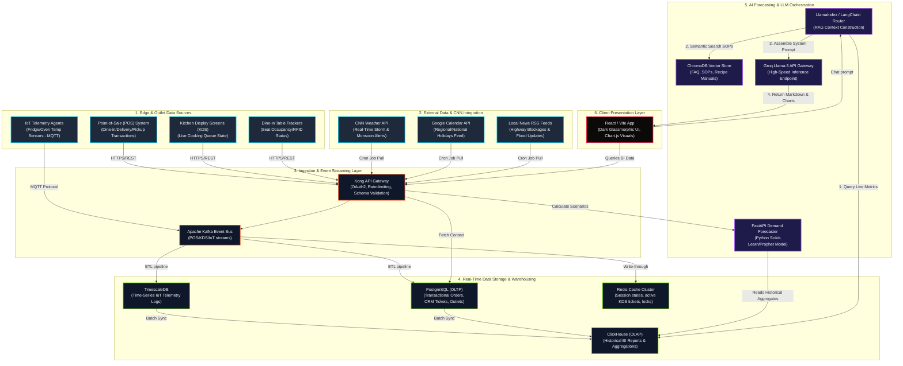

# Martinoz Franchise Intelligence Platform (FIP): Real-World System Architecture

This document maps out the production-grade, real-world system architecture for the Martinoz Pizza Franchise Intelligence Platform. It illustrates how edge IoT devices, transactional POS endpoints, external CNN weather feeds, predictive ML microservices, and LLM orchestration flow together to power the corporate control room.

---

## 1. System Design Infographic

---

## 2. Functional Data Flow Diagram

---

## 3. Component Pipeline Details

### A. Edge & Data Integration (POS, IoT, CNN)
- **POS Transactions**: Captures every pizza sale, ticket pricing, and coupon codes. This feed updates corporate revenue statistics in real time.
- **IoT Telemetry**: Deployed directly inside cold-storage walk-in freezers (sending fridge temperatures) and baking conveyor ovens (sending cooking temperatures). Temperature flags (e.g. `fridge > 5°C` or `oven < 220°C`) trigger instant alerts in the control room.
- **CNN & External API Integration**: Ingests real-time monsoon storms, severe heatwaves, and public holidays. This feed is critical because:
  - Rainy forecasts close outdoor tables, trigger delivery transit delays, and shift consumer habits towards hot comfort foods.
  - Heatwaves reduce lunch hour dine-in counts by 15% and trigger compressor warnings on cold room IoT systems.

### B. Ingestion & Event Stream (Kafka / Gateway)
- **Apache Kafka**: Handles high-velocity telemetry logs from 40+ outlets simultaneously.
- **Kong API Gateway**: Secures client requests, performs token-based authentication, and maps frontend requests to target microservices.

### C. Data Storage (OLTP + OLAP)
- **PostgreSQL**: Manages active operational states, including complaints CRM tickets, outlet manager contacts, and active marketing promotions.
- **ClickHouse (OLAP)**: A column-oriented database optimized for fast business intelligence analytical queries (e.g., graphing sales trends across 1,000,000 historical transactions in milliseconds).

### D. AI Forecasting & Co-Pilot LLM
- **Predictive Engine (Python/FastAPI)**: Uses historical sales logs, current weekday factors, CNN weather forecasts, and promotional triggers to predict pizza dough portions, cheese, and sides requirements for the next shift.
- **LLM Co-Pilot Router**: 
  1. Accepts the user's natural language question (e.g. *"Show sales in Surat"*).
  2. Runs a semantic lookup on internal recipes or query structures.
  3. Pulls real-time statistics from ClickHouse.
  4. Bundles the SQL outcomes, prompt history, and operational rules into a structured context payload.
  5. Sends the payload to **Groq Llama-3** to output concise formatting and chart definitions (`[CMD: {...}]`) for the client.

### E. Frontend Presentation (Vite/React)
- **UI Framework**: React with Tailwind/CSS glassmorphic style templates.
- **Render Engine**: Renders dynamic interactive charts (Chart.js) and 3D card tilts (perspective transforms) to present business diagnostics.

---

## 4. Real-World Scenario Walkthrough

### Scenario: Severe Monsoon Storm hits Bopal Crossroad Outlet
1. **Monsoon Alert Ingestion**: The CNN weather system posts a high-wind rain warning.
2. **Logistics Rerouting**: Central supply monitors transit truck TRK-402 and adjusts dough/cheese schedules.
3. **Operations Adjustment**: Table occupancy models automatically flag table 10 (garden patio) as closed.
4. **LLM Explainer**: Copilot retrieves Bopal's telemetry metrics, lists the patio wind-closure, and recommends a localized promotional push.
